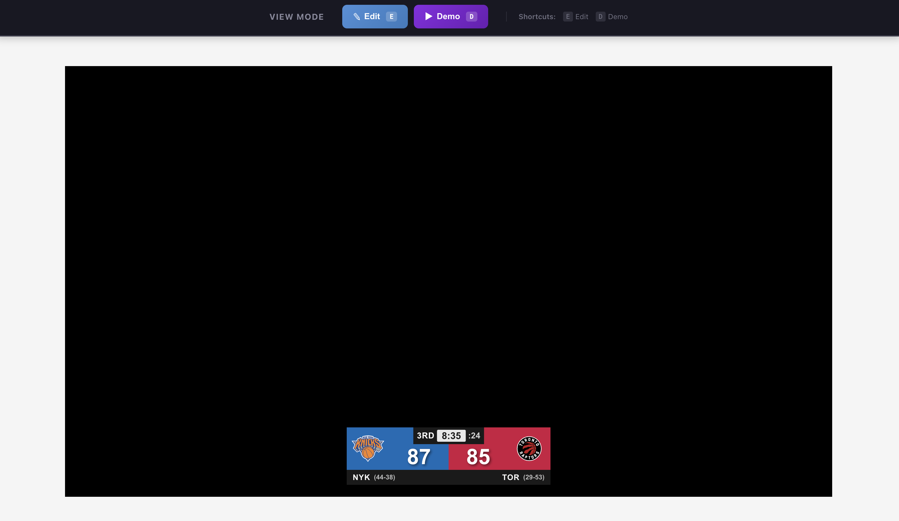

<a id="top"></a>
<div align="center">
  <h1>🏀 Basketball Graphics</h1>

  <p align="center">
    Interactive NBA scorebug editor with real-time validation and demo playback
    <br />
    <a href="https://dev-basketball-graphics.apps.gaspar.ontampa.dev/">View Live Demo</a>
    ·
    <a href="https://github.com/AlexVCS/basketball-graphics/issues">Report Bug</a>
  </p>
</div>

## Table of Contents

[About](#about) |
[Screenshots](#screenshots) |
[Key Features](#key-features) |
[Built With](#built-with) |
[Local Project Setup](#local-project-setup) |
[Running the Project](#running-the-project) |
[Project Structure](#project-structure) |
[Contact](#contact)

## About

Basketball Graphics is a web-based scorebug editor designed for NBA game graphics. It provides an interactive interface for managing and displaying real-time game information including scores, team data, game clock, shot clock, and quarter information.

The application features three distinct modes:
- **View Mode**: Display the current scorebug state
- **Edit Mode**: Modify all scorebug fields with real-time validation
- **Demo Mode**: Watch synchronized video playback with live scorebug updates

Perfect for graphics operators, broadcast professionals, or developers building sports visualization tools.

<div align='right'>

[Back to Top](#top)

</div>

## Screenshots

<p align="middle">
  
  
</p>

<div align='right'>

[Back to Top](#top)

</div>

## Key Features

### 🎛️ Edit Mode
- Click any field on the scorebug to edit inline
- Team selection dropdown with search functionality
- Quarter selection dropdown
- Inline score, clock, and record editing

### ✅ Real-Time Validation
- **Game Clock**: MM:SS format, max 12:00
- **Shot Clock**: 0-24 seconds
- **Scores**: 0-999 range
- **Team Records**: (X-X) or (XX-XX) format, wins + losses ≤ 82
- **Quarters**: 1st, 2nd, 3rd, 4th, OT, OT1-OT5

### 🎬 Demo Playback
- Synchronized video playback with scorebug updates
- Game clock countdown synced to video timeline
- Score updates triggered at specific video timestamps
- Play/pause and seek controls

### 🏀 NBA Team Integration
- All 30 NBA teams included
- Official team colors and logos
- Searchable team selector with keyboard navigation

### ⌨️ Keyboard Shortcuts
| Key | Action |
|-----|--------|
| `E` | Enter Edit Mode |
| `D` | Enter Demo Mode |
| `S` | Save Changes (in Edit Mode) |
| `Esc` | Cancel/Exit Current Mode |

<div align='right'>

[Back to Top](#top)

</div>

## Built With

[![React][React-shield]][React-url]
[![TypeScript][TypeScript-shield]][TypeScript-url]
[![Vite][Vite-shield]][Vite-url]
[![ESLint][ESLint-shield]][ESLint-url]

<div align='right'>

[Back to Top](#top)

</div>

## Local Project Setup

Git and Node.js are required to run this project locally.

### Clone the repo

```bash
git clone https://github.com/AlexVCS/basketball-graphics.git
cd basketball-graphics
npm install
```

No environment variables are required for local development.

<div align='right'>

[Back to Top](#top)

</div>

## Running the Project

### Development

Start the development server with hot module replacement:

```bash
npm run dev
```

The app will be available at `http://localhost:5173`

### Production Build

Build the project for production:

```bash
npm run build
```

Preview the production build locally:

```bash
npm run preview
```

### Linting

Run ESLint to check for code issues:

```bash
npm run lint
```

<div align='right'>

[Back to Top](#top)

</div>

## Project Structure

```
src/
├── components/         # React components
│   ├── Scorebug.tsx   # Main scorebug display
│   ├── EditControls.tsx # Mode switching controls
│   ├── GraphicsLayout.tsx # Main layout and state
│   ├── TeamSelector.tsx # Team dropdown selector
│   └── DemoPlayground.tsx # Video playback component
├── hooks/             # Custom React hooks
│   └── useDemoPlayback.ts # Video sync hook
├── types/             # TypeScript definitions
│   └── scorebug.ts    # Core interfaces
├── data/              # Static data
│   ├── nbaTeams.ts    # NBA team information
│   └── demoScenarios.ts # Demo configurations
├── utils/             # Utility functions
│   └── validationUtils.ts # Field validation
└── styles/            # Global styles
```

<div align='right'>

[Back to Top](#top)

</div>

## Contact

<div align='center'>
Alex Curtis-Slep

[![LinkedIn-shield]][alex-linkedin-url][![GitHub-shield]][alex-github-url]

</div>

<div align='right'>

[Back to Top](#top)

</div>

<!-- Personal Links -->
[alex-linkedin-url]: https://www.linkedin.com/in/alexcurtisslep/
[alex-github-url]: https://github.com/AlexVCS
[GitHub-shield]: https://img.shields.io/badge/github-%23121011.svg?style=for-the-badge&logo=github&logoColor=white
[LinkedIn-shield]: https://img.shields.io/badge/linkedin-%230077B5.svg?style=for-the-badge&logo=linkedin&logoColor=white

<!-- Technology Shields -->
[React-shield]: https://img.shields.io/badge/React-61DAFB?style=for-the-badge&logo=react&logoColor=black
[React-url]: https://react.dev/
[TypeScript-shield]: https://img.shields.io/badge/TypeScript-3178C6?style=for-the-badge&logo=typescript&logoColor=white
[TypeScript-url]: https://www.typescriptlang.org/
[Vite-shield]: https://img.shields.io/badge/Vite-646CFF?style=for-the-badge&logo=vite&logoColor=white
[Vite-url]: https://vite.dev/
[ESLint-shield]: https://img.shields.io/badge/ESLint-4B32C3?style=for-the-badge&logo=eslint&logoColor=white
[ESLint-url]: https://eslint.org/
